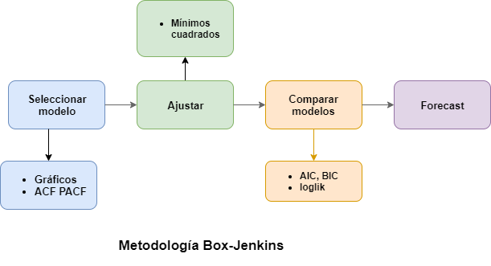

## Metodología para la predicción con modelos SARIMA Bayesianos

Una de las aplicaciones más importantes en el análisis de serie temporales es la predicción, esto es, estimar valores futuros que generalmente son desconocidos, para esto existen diferentes metodologías como los modelos de espacio y estado, Prophet, redes neuronales, splines, procesos Gaussianos, entre otros. Una clase de modelos muy populares por su fácil interpretación y alta capacidad predictiva son los modelos SARIMA, pero su implementación con datos reales es compleja debido a que seleccionar el orden del modelo es una tarea complicada. Box y Jenkins (1970) propusieron una metodología para el uso adecuado de dichos modelos, la cual se basa en seis etapas iterativas: *visualización de los datos, definición del modelo, estimación de parámetros, diagnóstico, selección del modelo y predicción*. Dicha metodología se ilustra en la Figura:

Existen muchos esquemas para el proceso de inferencia, y en los últimos años la inferencia Bayesiana se ha vuelto una alternativa muy utilizada para el análisis de datos con muchas aplicaciones en economía, física, química, psicología, entre otras. Su creciente popularidad se debe a su capacidad de incorporar información externa al modelo mediante una distribución a priori, y actualizar las creencias mediante el Teorema de Bayes. Este enfoque de inferencia en la práctica es muy complicado, por lo cual en los últimos años se han aproximado los resultados mediante los métodos de Markov Chain Monte Carlo. Estos métodos consisten en generar una cadena de Markov cuya distribución estacionaria es la distribución a posteriori del modelo, existen muchos procedimientos para implementar estos métodos, uno de los más comunes es el Monte-Carlo Hamiltoneano que por su flexible implementación en el lenguaje Stan ha sido de utilidad en múltiples aplicaciones.
	
El mayor obstáculo al momento de realizar un análisis de datos adecuado en un enfoque Bayesiano, es que los procedimientos de estimación, diagnóstico, y selección utilizados en *Box y Jenkins (1970)* no son válidos en este nuevo enfoque. *Gelman, Vehtari et. al. (2020)* proponen una extensa y robusta metodología denominada *"Bayesian workflow"*, que presenta diferentes herramientas para un análisis de datos adecuado. Esta metodología se basa en la  propuesta por *Box y Jenkins (1970)*, y se generaliza para cualquier tipo de modelamiento que involucre un enfoque de inferencia probabilístico.

Los dos principales problemas del método de *Gelman, Vehtari et. al. (2020)* al ser aplicados en el análisis de series temporales son su compleja estructura, y que algunas herramientas no son adecuadas para datos con supuestos de dependencia, por lo tanto, en este estudio presentamos una simplificación del *Bayesian Workflow*  con ligeras variaciones en algunas de las herramientas para su adecuado uso en series temporales.

Finalmente,  ilustrar la utilidad de la metodología  propuesta con tres aplicaciones diferentes, el Índice de Precios al Consumidor en Honduras (IPC) de 1980 al 2018, la tasa de cambio de divisas entre Alemania y Reino Unido de 1984 a 1991 y la afluencia de turistas en Australia de 1995 al 2015, cada uno de estos conjuntos se encuentran en el paquete *bayesforecast*  que se especializa en el análisis Bayesiano de series temporales. Por último con los resultados de dichas pruebas se demostrará la funcionalidad del nuevo método propuesto.

